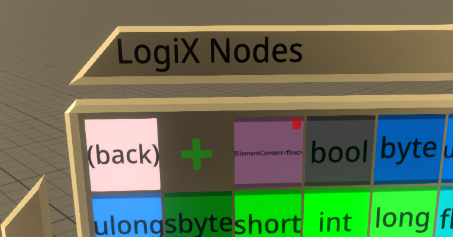

# Custom LogiX Types

A [NeosModLoader](https://github.com/zkxs/NeosModLoader) mod for [Neos VR](https://neos.com/) that adds a convenient way to use advanced LogiX types, so you don't have to do it manually through an inspector

## Installation
1. Install [NeosModLoader](https://github.com/zkxs/NeosModLoader).
2. Place [CustomLogiXTypes.dll](https://github.com/TheJebForge/CustomLogiXTypes/releases/latest/download/CustomLogiXTypes.dll) into your `nml_mods` folder. This folder should be at `C:\Program Files (x86)\Steam\steamapps\common\NeosVR\nml_mods` for a default install. You can create it if it's missing, or if you launch the game once with NeosModLoader installed it will create the folder for you.
3. Start the game. If you want to verify that the mod is working you can check your Neos logs.
